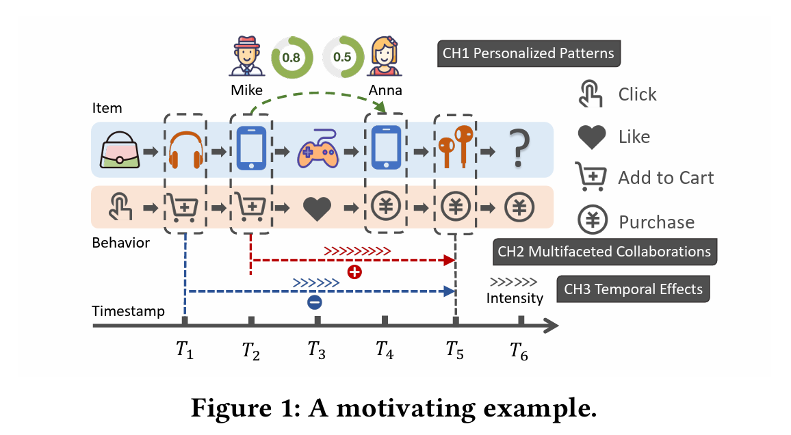

- **abstarct**

  Sequential Recommendation (SR) 捕捉用户通过建模用户在物品之间的转换而形成的动态偏好。然而，当序列较短时，仅使用单一类型的行为交互数据的SR模型会遇到性能下降的问题。为了解决这个问题，我们在本文中关注了Multi-Behavior Sequential Recommendation (MBSR)，旨在利用时变的异构行为依赖关系，以更好地探索用户对目标行为的潜在意图。解决MBSR问题是具有挑战性的。一方面，由于个人特征，用户表现出多样化的多行为模式。另一方面，行为相关性和物品协同作用之间存在全面的相互影响，其强度受时间因素的深刻影响。为了解决这些挑战，我们提出了一个名为Personalized Behavior-Aware Transformer framework (PBAT)的框架，用于解决MBSR问题。该框架以一种新颖的方式在表示层中开发了一个个性化行为模式生成器，以提取动态且具有区分度的行为模式进行顺序学习。其次，PBAT通过引入一个行为感知协作提取器改革了自注意力层，该提取器引入了一个融合了行为感知和时间影响的注意机制，以将协作转换中的行为和时间影响结合在一起。我们在三个基准数据集上进行了实验证明了我们框架的有效性和可解释性。我们的实现代码发布在 https://github.com/TiliaceaeSU/PBAT。

  ## **1 INTRODUCTION**

  推荐系统已广泛应用于在线平台，以提供准确的内容以缓解信息爆炸。顺序推荐（SR）[13, 28, 30, 50]是推荐系统中的核心任务之一，旨在捕捉用户根据其历史行为的时间变化的兴趣，并进行下一个物品的推荐。

  随着神经网络的进步，各种顺序推荐（SR）模型[11, 27, 37, 41]已经有效地提取了序列信号，用于推断购买意图。然而，大多数这些方法都专为单一行为设置而设计，这使它们在处理单一行为序列短、即数据稀疏问题时面临困难。实际上，除了最常见的目标行为购买之外，在电子商务平台上还存在其他许多实际交互形式，如点击、点赞和加入购物车，这些反映了更精细和有意义的用户偏好，隐藏在顺序上下文之下。为了解决上述问题，本文聚焦于多行为顺序推荐（MBSR），旨在捕捉和利用辅助行为与目标行为之间的动态协作信号，在多行为序列中实现更好的推荐结果。

  一些开创性的研究已经对MBSR问题进行了调查。一系列研究[8, 31, 45]通过行为类型划分多行为序列，提取行为特定子序列之间的相互影响。另一方面的研究[17, 29, 52]独立建模了物品和行为序列，将行为知识视为表示的辅助组件。近期的研究[44, 46]将行为交互上下文注入到物品转换中，探索用户兴趣的具有行为感知的过渡模式。

  尽管这些方法在行为视角上取得了开创性的突破，但MBSR问题仍然具有以下挑战：

  - 挑战1：个性化的多行为模式。由于个人特征，不同用户表现出各种在线行为习惯。如图1所示，Mike习惯将他很可能购买的商品添加到购物车中。但是对于Anna，将商品添加到购物车和实际购买之间没有明显的相关性。不同用户之间不同类型的交互行为之间存在相互依赖。因此，使用固定的范式来建模所有用户的顺序行为模式是不合适的，如何描绘个性化的多行为模式仍然是一个具有挑战性的问题。

  

  

  

  添加图片注释，不超过 140 字（可选）

  -  挑战2：多方面的行为感知协作。相同类型的行为对之间的相互作用呈现出不同商品之间的多样化协作。在图1中，以Cart-to-Purchase行为对为例。将手机添加到购物车会促使用户稍后购买蓝牙耳机，因为它们在使用上是互补的。而将耳机添加到购物车则会降低购买耳机的概率，因为存在产品竞争关系。行为序列暗示了潜在的协作商品关系，反之，商品协作影响了行为转换的影响。因此，跨商品侧和行为侧的顺序依赖关系之间的相互影响使得利用多方面的协作变得困难。
  - 挑战3：协作强度的时间效应。交互行为对之间的位置距离直接影响它们的相关程度。直观地说，间隔越小，协作越强烈。许多先前的研究[27, 44]在建模顺序模式时考虑了位置信息。但它们通常将位置标签编码到物品表示中，其中很少有研究探讨时间间隔如何直接影响行为感知的协作。在顺序上下文中探索物品、行为和位置之间的复杂三元关系仍然是一个待解决的问题。